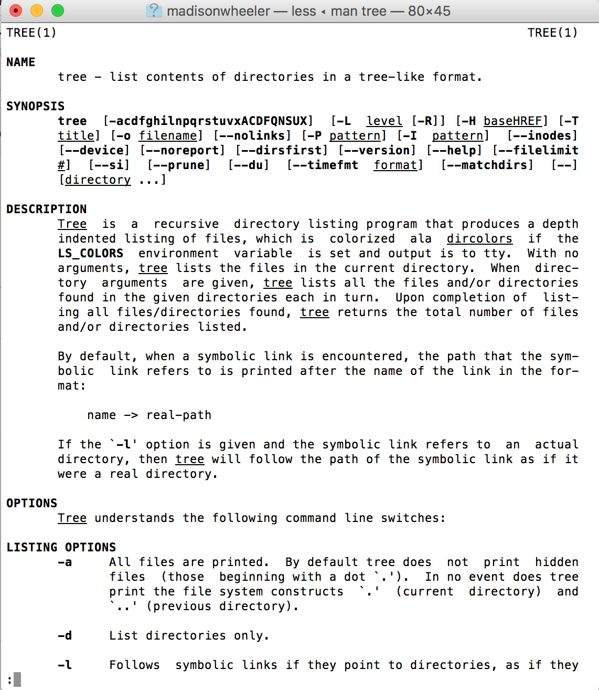
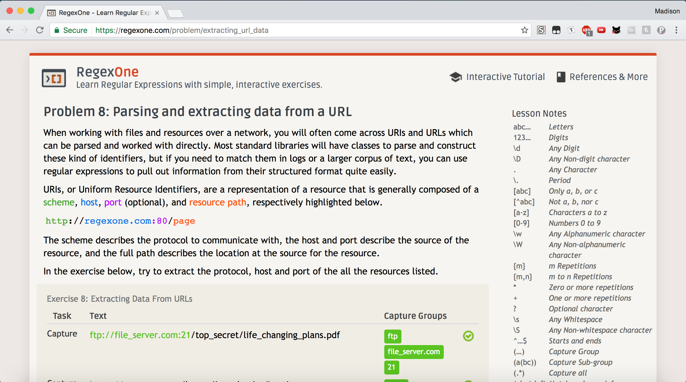
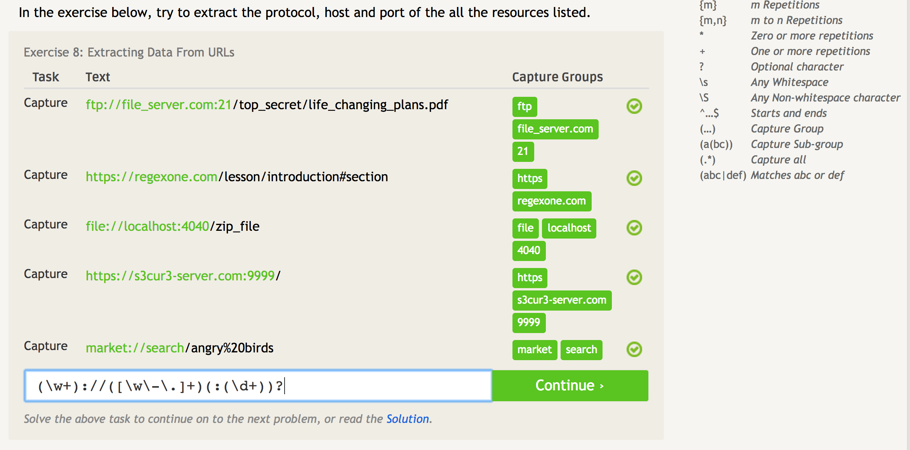
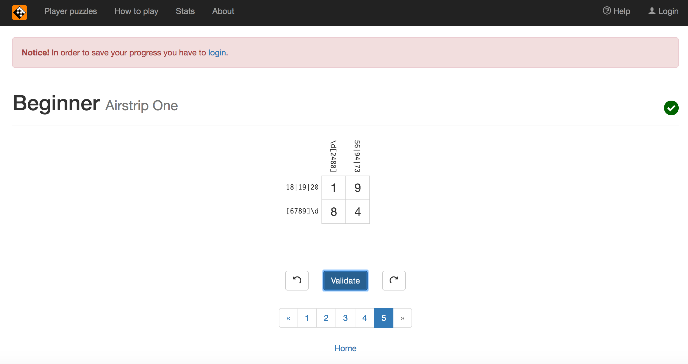
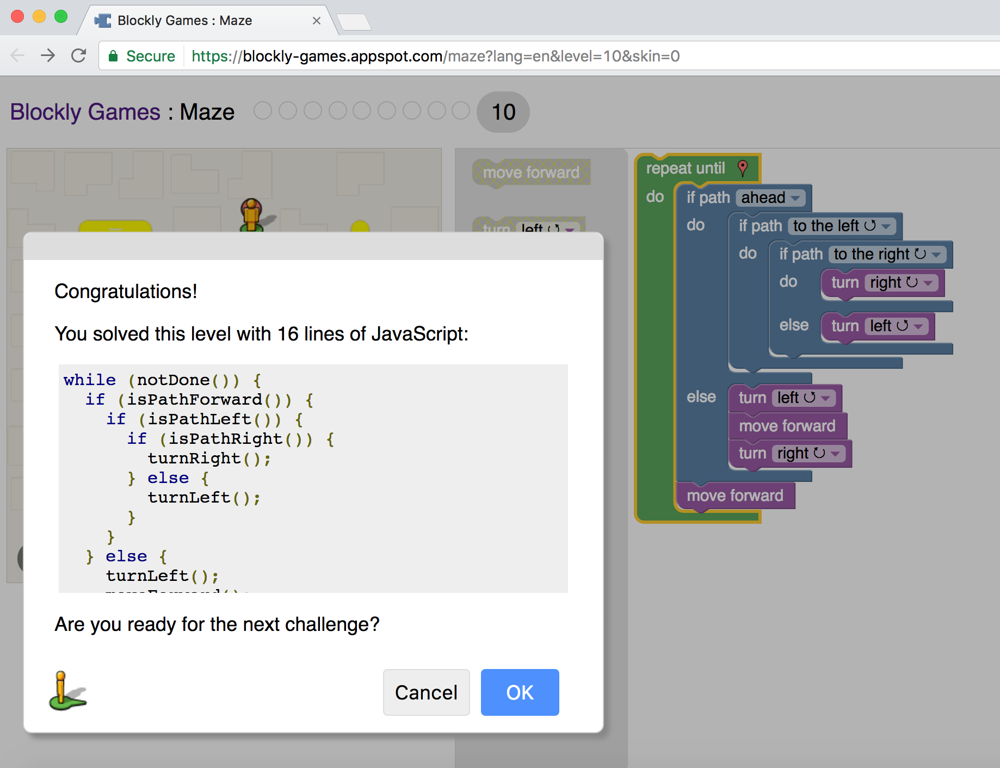

**c. 2)** 
      * One suggestion I have is to do research on the person you're asking the question to. Make sure the person 
        you're asking is of the right skill level to answer your question.
      * A second suggestion I have is to ask your question with confidence, but don't be too overconfident. The more 
        informed you are about the question you are about to ask the easier it will be to be confident. The less 
        hesitant you are the more likely people will be receptive to your question.

**c. 3)** Reading that chapter really surprised me, mostly because I've never heard of Jesse or his story before.
          I feel like I should have known about his story as a Computer Science major at RPI. One thing I got out 
          of this chapter is a reminder to be careful about what you make and release, and to always plan for the worst
          case scenario. I think what happened to Jesse was really unfair and ultimately falls under this issue
          of whether we should value intent or actions more, especially in a legal sense. When is comes to software
          and applications it's always a grey area of whether or not the creators of these platforms are responsible 
          for the unintended actions of their users. Personally I'm not 100% set on either side and think it matters 
          on a case by case basis. In this case I believe that Jesse's intent should of been taken into consideration 
          more than the actions of the users of Jesse's search engine. Despite being frustrated by Jesse's situation, 
          the chapter inspired me, specifically because it's a story about an RPI student who created something important
          and useful.

**d.**
       **Photo:** 

**e.**
       **Practice Problem 8:** 
       
       
       **Crossword Problem 5:** 

**f.**
       **Blockly:** 
     

**g.** So far I don't have a specific project/problem that intrests me but I am searching for projects. Right now, I 
       am searching for projects using the GitHub Explore page for ideas. I know that I proabably don't want to work 
       on a web based project or a game so I'm trying to find someting else that intrests me.
