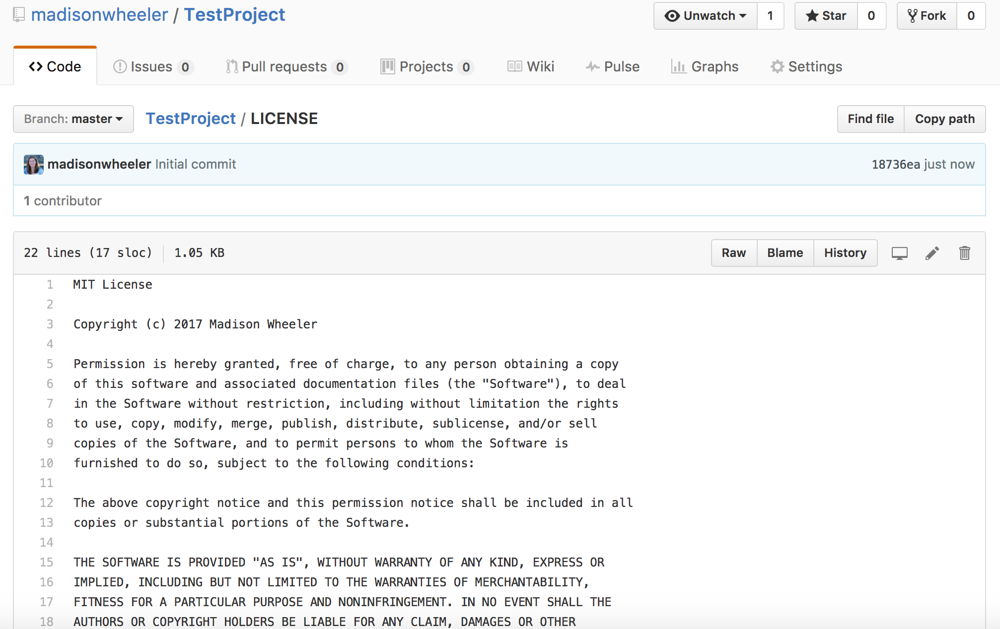

**2. Why it is important to choose a LICENSE?** 
It's important to choose a license because it determines how your work can be used and how much ownership 
you have over it. Licenses set a legal precedent for how your code/software can be used, distributed, and 
modified. Without a license it is unclear how your software can be used/distributed/modified so choosing
a license lets you control this.

**3. Why is it important that you SHOULDN'T use a project that doesn't have an explicit license?**
It is it important that you shouldn't use a project that doesn't have an explicit license because
without a license you have no idea what rights you have to use that project. Therefore you have
no idea how much ownership the creator of the project has over it and could get in legal trouble
because it is not explicitly stated in a license that you have the right to use it.

**4. Do you agree with this claim?**
Overall I agree with this claim, the Web beat Gopher. I liked how the article hit on not only
technical reasons why the Web beat Gopher but also social reasons, which in my opinion are the 
most important. Something that probably had a pretty large impact on this claim that the article
didn't really go too in depth with is that the web was much more accepting of the idea of open
source.

**5. Can you justify why such a license is chosen**
Microsoft .NET Core uses MIT license to allow for open source contributions. Primarily they use
a MIT license to lay the foundation for a cross platform .NET, and build and leverage a stronger 
ecosystem. It allows Microsoft to engage with customers and allows the public to contribute to
agile development.

**6. Think of an example project. Pick a license (as a group) using the LICENSE chooser by Github.**
An example project is a sheet music editing project used through it's own language, similar to 
Alda. The license I would choose for it is an MIT license.

**7. Read these licenses GPL, LGPL and Apache/BSD and discuss which one will be better - for a 
developer, for a company and for the common good**
For a developer, a LGPL license would be better. This is because it allows the developer to distribute
projects for commercial usage and does not hold them liable for damages. For a company, an Apache/BSD
license would be best. This is because it protects patents. which would be of use to companies. For the 
common good, a GPL license would be better. This is because a diverse array of projects can all fit under 
this license.

**8.Create a repository and choose a license.**

**9. Write five sentences about choosing a project to work on in this course, who will be users/customers 
of the project, and what license will you choose.**
I'm still not 100% sure what project I'd like to work on for this course but I'd like it to be an already 
exsisting project that I can contribute to rather than creating my own project from scratch. That way i can get 
more experince with contributing to other open source projects and collaboration. Therefore, the license for 
the project I choose will already be chosen by the creator of the project but I'm hoping it will be an MIT
license. I'm thinking of contributing to music playing/writing similar to Alda or Radiant Music Player 
except more open to beginner contributions.

| Left align | Right align | Center align |
|:-----------|------------:|:------------:|
| This       |        This |     This     
| column     |      column |    column    
| will       |        will |     will     
| be         |          be |      be      
| left       |       right |    center    
| aligned    |     aligned |   aligned

**10.**
| Website                               | License Present? | License     |
|:--------------------------------------|:-----------------|:------------|
| https://github.com/faroos3/pellio     | Yes              | MIT License |
| https://github.com/andywu9/studybuddy | No               | None listed |
| https://github.com/justinbot/timecard | Yes              | MIT License |
| https://github.com/yacs-rcos/yacs     | Yes              | MIT License |
| https://github.com/aesakamar/treeapp  | Yes              | MIT License |

