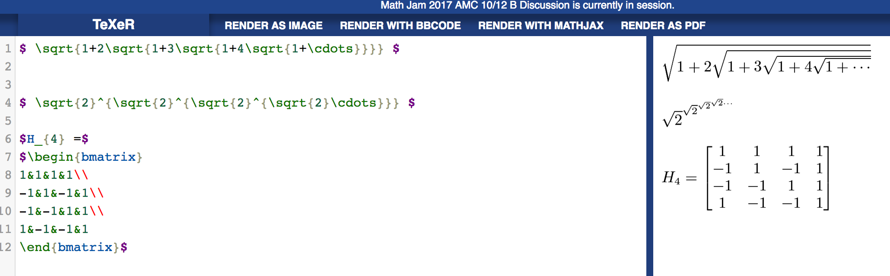
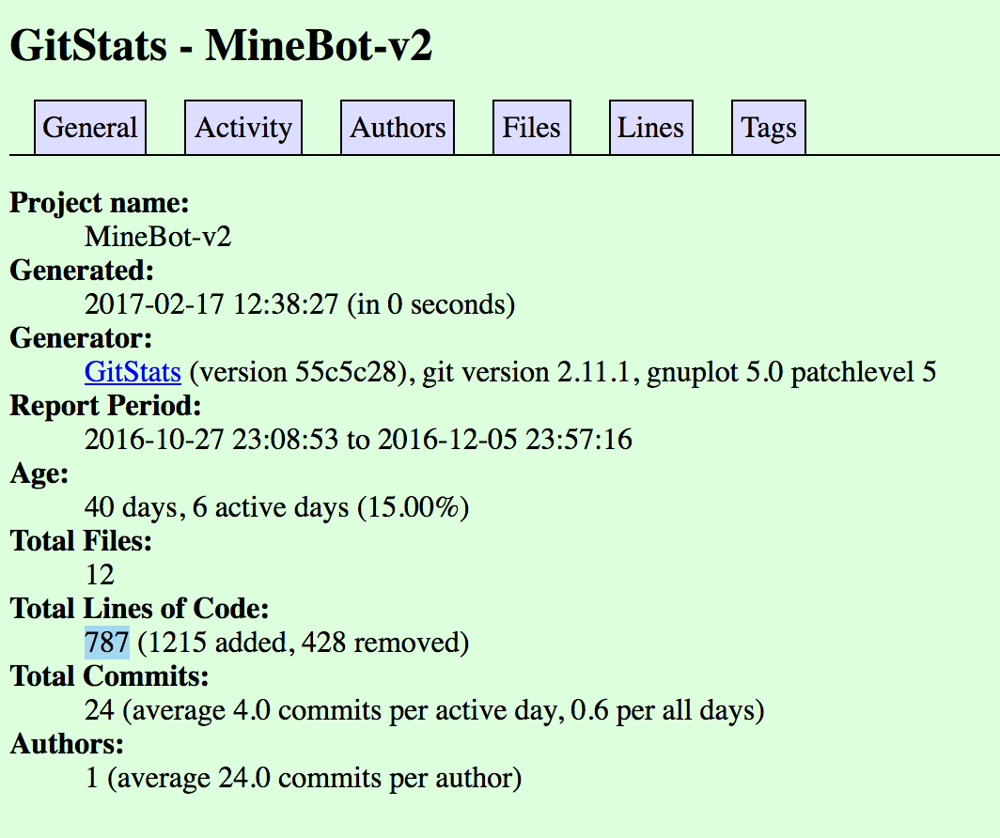
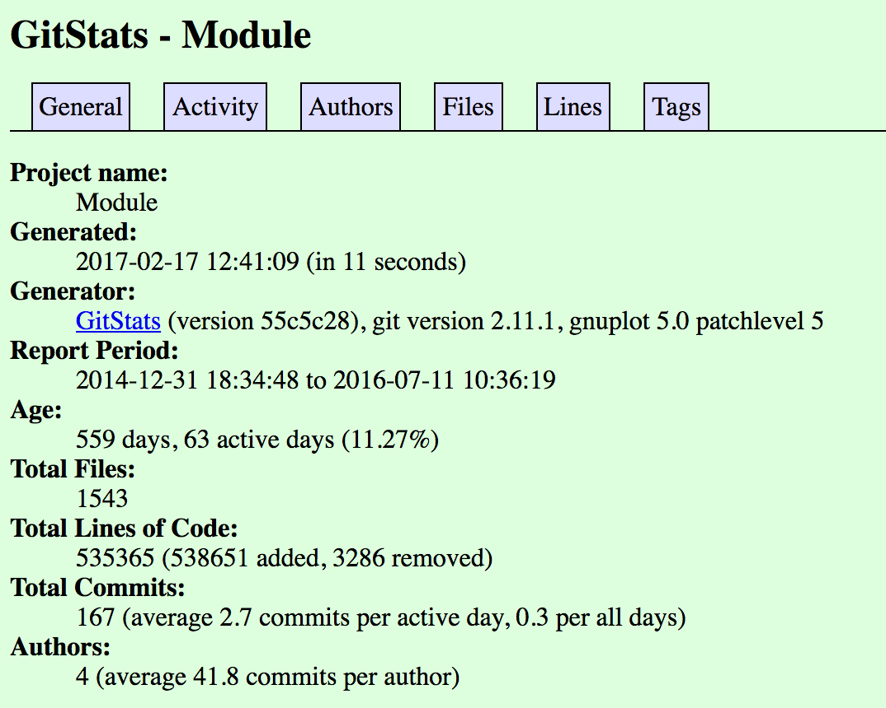
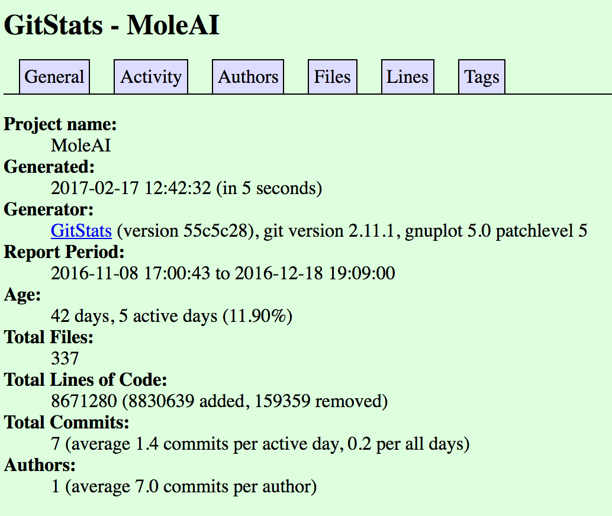
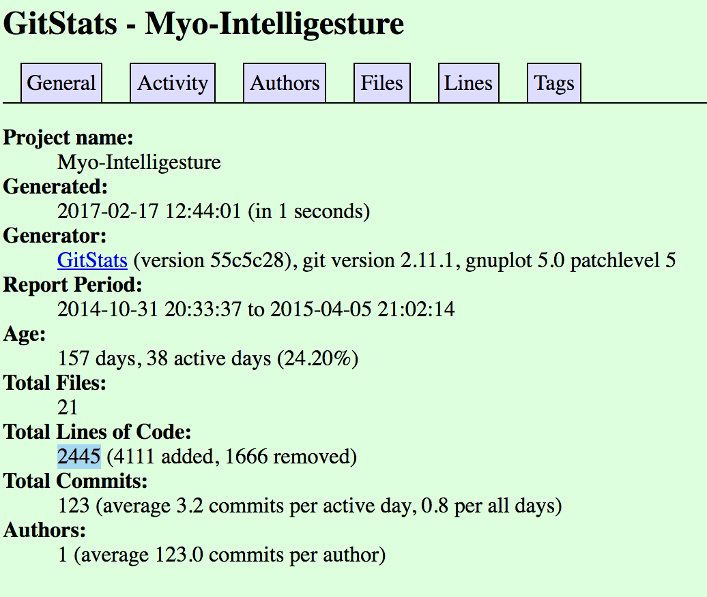
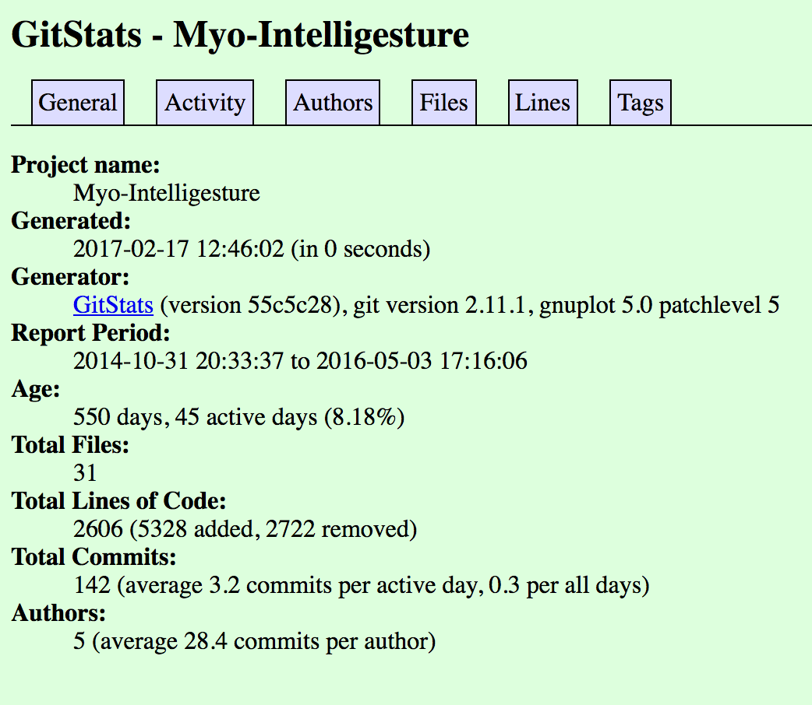

** Part 0: **

**Part 1:**

*1:*

1. MineBot v2

    * 1 contributer

    * 963 lines

    * First Commit: Initial Commit - Oct 27, 2016

    * Last Commit: Updated README.md - Dec 5, 2016

    * Branches: Master

2. Module Game Engine

    * 3 contributers

    * 870871 lines

    * First Commit: Initial Commit - Dec 31, 2014

    * Last Commit: Merge branch 'dev' of github.com:AaronPerl/Module into dev - July 11, 2016

    * Branches: dev, netcode, graphics-testing, gh-pages, stable

3. Mole AI

    * 1 contributer

    * 8756296 lines

    * First Commit: Added building class - Nov 8, 2016

    * Last Commit: Tweaks, fixes, and functionality enhancement  - Dec 18, 2016

    * Branches: master

4. Myo-Intelligesture

    * 1 contributer

    * 2442 lines

    * First Commit: Initial Comment - Oct 31, 2014

    * Last Commit: Make most private class variables const - April 5, 2015

    * Branches: master

5. Myo-Intelligesture

    * 3 contributers

    * 2601 lines

    * First Commit: Initial Comment - Oct 31, 2014

    * Last Commit: Merge branch 'master' of https://github.com/sashashin/Myo-Intelligesture - May 3, 2016

    * Branches: master

**2:**

1. Lines of code is only 787 in GitStats

2. GitStats says 4 authors instead of 3, and 535365 lines of code

3. Lines of code is 8671280

4. Lines of code is 2445

5. Lines of code is 2606

**3 - Videos:**

1. https://www.youtube.com/watch?v=HaQR9GS-RIA

2. https://www.youtube.com/watch?v=hhUHp7GdnEE

3. Too short to upload to youtube but I have the mp4

4. https://youtu.be/4IPNBOocrUo

5. https://youtu.be/a2pGrUY37nw

Leaders:

1. MKD93

2. AaronPerl

3. amanz360

4. VoidingWarranties

5. sashashin

**Part 2:**

Test Cases file: https://github.com/madisonwheeler/Labs/blob/master/Lab5/test_markdown_unittest.py

Results:

> python test_markdown_unittest.py
FFF
======================================================================
FAIL: test_em (__main__.TestMarkdownPy)
----------------------------------------------------------------------
Traceback (most recent call last):
  File "test_markdown_unittest.py", line 29, in test_em
    '<em>this should be wrapped in em tags</em>
')
AssertionError: '*this should be wrapped in em tags*' != '
<em>this should be wrapped in em tags</em>
'
 
======================================================================
FAIL: test_non_marked_lines (__main__.TestMarkdownPy)
----------------------------------------------------------------------
Traceback (most recent call last):
  File "test_markdown_unittest.py", line 21, in test_non_marked_lines
    '
this line has no special handling
')
AssertionError: 'this line has no special handling' != '
this line has no special handling
'
 
======================================================================
FAIL: test_strong (__main__.TestMarkdownPy)
----------------------------------------------------------------------
Traceback (most recent call last):
  File "test_markdown_unittest.py", line 37, in test_strong
    '
<strong>this should be wrapped in strong tags</strong>
')
AssertionError: '**this should be wrapped in strong tags**' != '
<strong>this should be wrapped in strong tags</strong>
'
 
======================================================================
FAIL: test_h1 (__main__.TestMarkdownPy)
----------------------------------------------------------------------
Traceback (most recent call last):
  File "test_markdown_unittest.py", line 41, in test_h1
    '<h1>this should be wrapped in strong tags</h1>')
AssertionError: '#this should be wrapped in strong tags' != '<h1>this should be wrapped in strong tags</h1>'
 
======================================================================
======================================================================
FAIL: test_h2 (__main__.TestMarkdownPy)
----------------------------------------------------------------------
Traceback (most recent call last):
  File "test_markdown_unittest.py", line 41, in test_h2
    '<h2>this should be wrapped in strong tags</h2>')
AssertionError: '##this should be wrapped in strong tags' != '<h2>this should be wrapped in strong tags</h2>'
 
======================================================================
======================================================================
FAIL: test_h3 (__main__.TestMarkdownPy)
----------------------------------------------------------------------
Traceback (most recent call last):
  File "test_markdown_unittest.py", line 41, in test_h3
    '<h3>this should be wrapped in strong tags</h3>')
AssertionError: '###this should be wrapped in strong tags' != '<h3>this should be wrapped in strong tags</h3>'
 
======================================================================
======================================================================
FAIL: test_blockquote (__main__.TestMarkdownPy)
----------------------------------------------------------------------
Traceback (most recent call last):
  File "test_markdown_unittest.py", line 21, in test_blockquote
    '<blockquote>this should be wrapped in strong tags</blockquote>')
AssertionError: '>this should be wrapped in strong tags' != '<blockquote>this should be wrapped in strong tags</blockquote>'
 
----------------------------------------------------------------------
Ran 7 tests in 0.142s
 
FAILED (failures=7)

  

