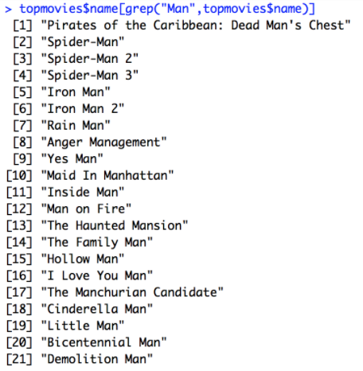

**3. Code used:**

rules.all <- apriori(admissions)
inspect(rules.all)
rules <- apriori(admissions, control = list(verbose=F),
                 parameter = list(minlen=2, supp=0.005, conf=0.8),
                 appearance = list(rhs=c("admit=0", "admit=1"),
                                   default="lhs"))
quality(rules) <- round(quality(rules), digits=3)
rules.sorted <- sort(rules, by="lift")
inspect(rules.sorted)

rules.all <- apriori(admissions)
inspect(rules.all)
rules <- apriori(admissions, control = list(verbose=F),
                 parameter = list(minlen=2, supp=0.005, conf=0.8),
                 appearance = list(rhs=c("rank=4", "rank=2"),
                                   default="lhs"))
quality(rules) <- round(quality(rules), digits=3)
rules.sorted <- sort(rules, by="lift")
inspect(rules.sorted)

**Associaton Rules:**

**4.**

**5.**

**7.** We have made some pretty good progress on our project. We each have been 
researching QT and have implemented basic PDF viewers and text editors, so we are
right on schedule with our timeline. The license we are using is LGPL and we have 
started a slack channel. Last week I researched QT and made a text editor in QT
that we can eventually adapt into the note taking part of DeepReader. Our 
Observatory page is here: https://rcos.io/projects/shanalily/deepreader/profile
