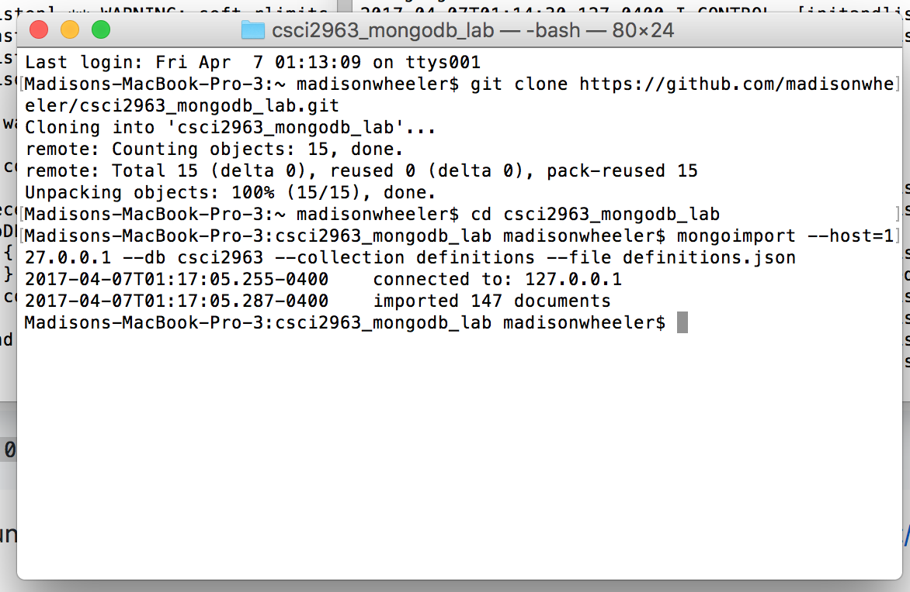
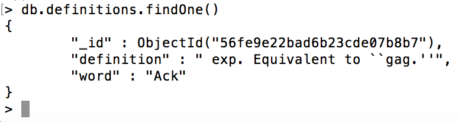

**Checkpoint 1:**

**Checkpoint 2:**

**Checkpoint 3:**

    > use csci2963
    > db
    > db.definitions
    > db.definitions.find()

    > db.definitions.findOne()

    > db.definitions.find({word: "Capitaland"})

    > db.definitions.insert({word: <word here>, definition: <definition here>})

    >>> mongoexport --host=127.0.0.1 --db csci2963 --collection definitions --out definitions.json

**Checkpoint 4:**

    from pymongo import MongoClient
    import bson
    from bson.objectid import ObjectId

    client = MongoClient()
    db = client.csci2963
    defs = db.definitions

    print "All records"
    for post in defs.find():
      print post

    print "\nOne record"
    doc = defs.find_one()
    print doc

    print "\nSpecific record"
    doc = defs.find_one({"word": "Capitaland"})
    print doc

    print "\nSpecific ID"
    def get(post_id):
      document = defs.find_one({'_id': ObjectId(post_id)})
      return document

    doc = get("56fe9e22bad6b23cde07b8ce")
    print doc

    print "\nInsert"
    post_id = defs.insert_one({"word": "Snufflepork", "definition": "grubblesnuff"})
    print post_id

**Checkpoint 5:**

    from pymongo import MongoClient
    import pymongo
    from random import randint
    import datetime
    client = MongoClient()

    db = client.csci2963
    defs = db.definitions

    n = defs.count()
    r = randint(0,n)
    #r = 8

    i = 0
    w = ""
    for word in defs.find():
        if i == r:
            w = word["word"]
            t = str(datetime.datetime.now())        
            defs.update({"word":w}, {"$push": {"dates": t}})
            break
        i+=1
    print defs.find_one({"word":w})
